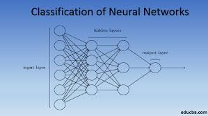
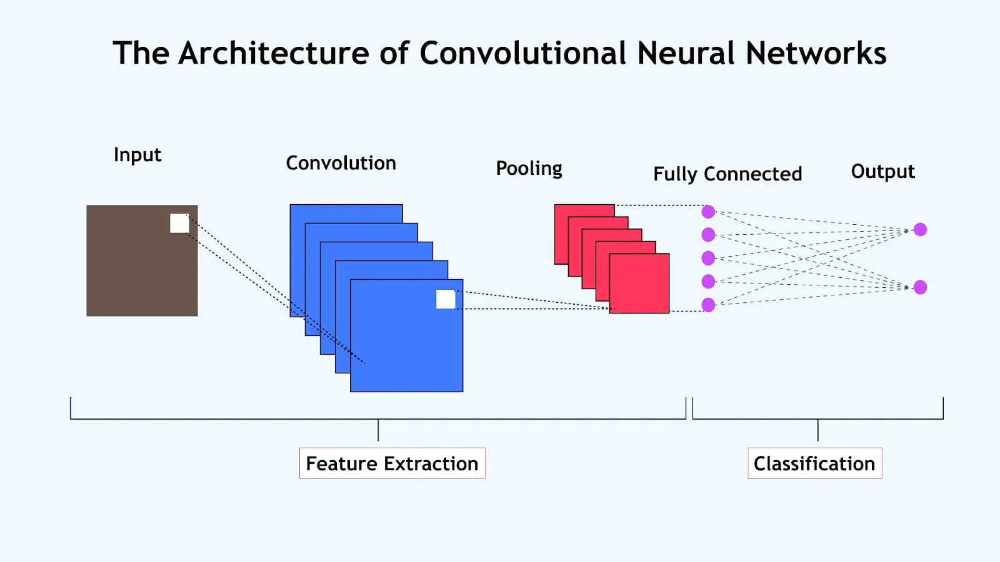
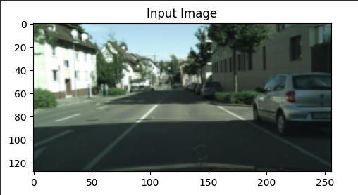
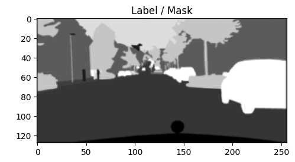

<!-- TITLE BANNER -->

  <h1 style="margin-bottom: 10px;">Neural Networks and Their Applications</h1>
  
From Basic Architectures to Sparse CNNs on Real-World Data

<!--  W&M Logo -->

  

<!-- Project Intro -->

  Welcome to my research project where I explore and compare traditional neural networks, convolutional neural networks (CNNs), and sparse CNNs using PyTorch. The project culminates in applying sparse architectures to the <strong>Cityscapes</strong> dataset — a real-world dataset used for autonomous vehicle vision tasks.

___

## Introduction

Neural networks are the foundation of modern AI, mimicking how the human brain processes information. Convolutional Neural Networks (CNNs) extend this by allowing networks to focus on spatial patterns — perfect for images. In this project, I take it a step further by exploring <strong>sparse CNNs</strong>, which reduce computational overhead while retaining accuracy, making them ideal for real-time systems like autonomous driving.

___

## Motivation & Goals

As the world moves toward intelligent systems, real-time image recognition is becoming a crucial technology. However, high computational costs limit CNN deployment in edge devices.

My goals:

- Understand and compare basic NNs, CNNs, and sparse CNNs.
- Implement these architectures from scratch in PyTorch.
- Evaluate their performance on benchmark datasets and <strong>Cityscapes</strong>.
- Showcase technical and analytical skills to future employers.

___

## Building a Simple Neural Network for Classification

  

Before diving into vision models, I implemented a basic neural network to classify images from simpler datasets such as MNIST and FashionMNIST. This helped me understand:

- Forward and backward propagation
- Weight updates using gradient descent
- Loss functions like CrossEntropy
- Accuracy tracking and visualization

<a href="./Basic_NN.html" style="display: inline-block; background-color: #004f2d; color: white; padding: 10px 20px; text-decoration: none; border-radius: 6px; font-weight: bold;">View Neural Network Demo</a>

___

## From CNNs to Sparse CNNs for Semantic Segmentation

  
  
A typical CNN architecture for segmentation tasks

Using convolutional architectures, I tested my knowledge further by building a Convolutional Neural Network with another benchmark dataset (Fashion MNIST). 

<a href="./Final_CNN.html" style="display: inline-block; background-color: #004f2d; color: white; padding: 10px 20px; text-decoration: none; border-radius: 6px; font-weight: bold;">View Neural Network Demo</a>
___

## CNN Benchmark Dataset Training & Validation Metrics (5-Fold Cross-Validation)

The following plots show the training and validation accuracy and loss across 5 folds. These visualizations help evaluate how well the model generalized and whether overfitting occurred.

  

     
    <small><strong>Training Accuracy per Fold (CNN)</strong></small>
  

  

     
    <small><strong>Validation Accuracy per Fold</strong></small>
  

  

     
    <small><strong>Training Loss per Fold (CNN)</strong></small>
  

  

     
    <small><strong>Validation Loss per Fold (CNN)</strong></small>
  

After mastering standard neural nets, I transitioned into real-world image tasks using convolutional architectures:

- <strong>CNNs</strong> were trained on downsampled Cityscapes images for pixel-level classification.
- A <strong>mini U-Net</strong> was implemented to recover resolution lost from pooling layers.
- I explored <strong>sparse CNNs</strong>, which ignore uninformative regions (like sky) to speed up computation.

> This evolution allowed me to explore the <strong>trade-off between model complexity, accuracy, and speed</strong> — critical for edge deployment.

___

## Visual Example: Cityscapes Input and Ground Truth

  

     
    <small>Original Input</small>
  

  

     
    <small>Ground Truth Mask</small>
  

___

## Key Takeaways

<ul>
  <li><strong>Neural networks</strong> are powerful but limited for spatial tasks.</li>
  <li><strong>U-Nets and CNNs</strong> are well-suited for pixel-level vision problems.</li>
  <li><strong>Sparse CNNs</strong> can dramatically reduce compute needs without major accuracy drops.</li>
  <li><strong>Visualizations</strong> help interpret what models are learning — especially in safety-critical domains.</li>
</ul>

___

## Resources

- <a href="https://github.com/hakandagli09/Research" target="_blank">GitHub Repo</a>
- <a href="https://www.cityscapes-dataset.com/" target="_blank">Cityscapes Dataset</a>
- <a href="https://pytorch.org/" target="_blank">PyTorch Docs</a>
